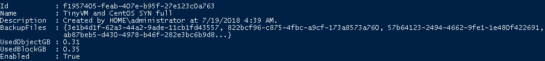

# Veeam Backup & Replication (VBR) Backup Usage

## Author

Chris Arceneaux (@chris_arceneaux)

## Function

This script will allow you to pull VBR Backup usage including space used in Backup Repositories and SOBR, including Performance & ***Capacity*** Tiers.

## Known Issues

* Oracle Archived Log Backups:
  * Backup sizes are **not** captured.
* Agent Protection Groups:
  * Backup sizes for standard agent backup is captured.
  * Backup sizes for Oracle/SQL Transaction Log backup are **not** captured.

## Requirements

* Veeam Backup & Replication 9.5 Update 4 *(might work with previous versions but untested)*
* Veeam Backup Administrator account
* Script can be executed from the following locations:
  * Veeam Backup & Replication server
  * Server with the Veeam Backup & Replication Console installed
* Network connectivity
  * Same access that [Veeam Backup & Replication Console Connections](https://helpcenter.veeam.com/docs/backup/vsphere/used_ports.html?ver=95u4) require.

## Usage

Get-Help .\Get-BackupUsage.ps1

The output of the script is a multi-layered PSObject with all the necessary information to pull VBR Backup usage from Backup Repositories *(block)* and SOBR, including both Performance *(block)* & Capacity *(object)* Tiers.

The key parameters you want is:

* **UsedBlockGB:** Standard Backup Repositories and SOBR Performance Tier
* **UsedObjectGB:** SOBR Capacity Tier

Here is a sample output:

