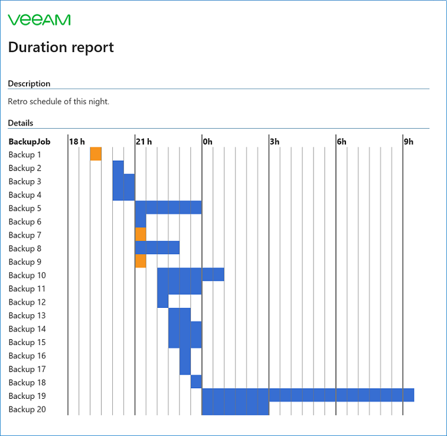

# Duration report


## Author
* Charly Froment

## Function
Generates a timeline with the last backups and send it by email.

## Known Issues
* Changing the time period in parameters may generate an inconsistent table

## Requirements
* Veeam Backup & Replication 11 (not tested on v12)
  
## Usage
Edit the parameters on top of the script, then you can start it.

```powershell
BR-DurationReport.ps1
```