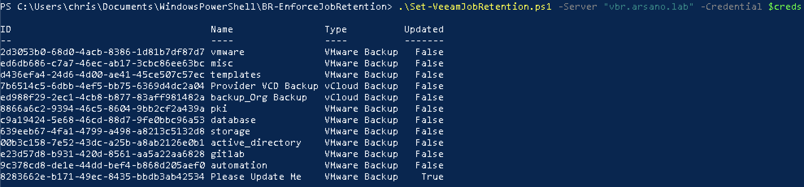

# Enforce Backup Job Basic Retention

## Author

Chris Arceneaux (@chris_arceneaux)

## Function

This script looks for both VMware Backup Jobs & vCloud Backup Jobs, retrieves their current retention setting (Restore Points), compares the retention against the published standard (joblist.csv), and adjusts the configuration where needed.

***NOTE:*** I strongly recommend you use the `-Verbose -WhatIf` flags when running this script in your environment for the first time. This will allow you to see which jobs would be updated. Then, you can create exceptions in the `joblist.csv` file where necessary.

## Known Issues

* *No known issues*

## Requirements

* Veeam Backup & Replication 11 *(might work with previous versions but untested)*
* Veeam Backup Administrator account
* Script can be executed from the following locations:
  * Veeam Backup & Replication server
  * Server with the Veeam Backup & Replication Console installed
* Network connectivity
  * Same access that [Veeam Backup & Replication Console Connections](https://helpcenter.veeam.com/docs/backup/vsphere/used_ports.html?ver=110#veeam-backup---replication-console-connections) require.

## Usage

`Get-Help .\Set-VeeamJobRetention.ps1 -Full`

The output of the script is a PSObject containing a list of all reviewed Backup Jobs.

The `joblist.csv` file contains the two *default* Restore Point configurations and any Backup Jobs that are required to deviate from the standard.

Here is a sample output:

