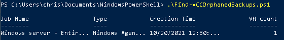
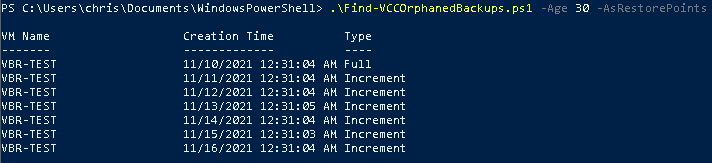

# Cloud Connect Orphaned Backups Report

## Author

Chris Arceneaux (@chris_arceneaux)

## Function

This script looks for backups that are no longer tied to an active Backup Job and then filters the results depending on the parameters specified.

Further background info on this script... When a Copy Job (or Backup Job) is deleted that was sending its backups to a (Cloud Connect) Cloud Repository, the backup files are not deleted by default. This behavior is great as it enables a backup administrator to hold on to the backups according to their company's retention policy. Sometimes, though, these backups are forgotten which results in additional storage consumed in the Cloud Repository which translates to higher storage costs. This script provides an automated method of identifying these backups so they aren't forgotten.

***NOTE:*** This script is designed to be executed on a Veeam Backup & Replication server that sends backups to a Cloud Repository. **It will not work if executed on a Cloud Connect server.**

## Known Issues

**If multiple entities, not managed by the Veeam Backup & Replication server, send backups to the same Cloud Repository, this results in backups being classified as orphaned erroneously.**

For example:

* Multiple VBR servers using the same Cloud Repository
* Backup agents (VAW/VAL/VAM) not managed by the VBR server using the same Cloud Repository

WORKAROUND: Return *restore points* by specifying the `-AsRestorePoints` flag in the script as well as filter out current restore points by `Age` using built-in script functionality. Sample code to only return restore points older than 30 days:

```powershell
.\Find-VCCOrphanedBackups.ps1 -Age 30 -AsRestorePoints
```

## Requirements

* Veeam Backup & Replication v11
  * *might work with other versions but untested*

## Usage

Get-Help .\Find-VCCOrphanedBackups.ps1 -Full




