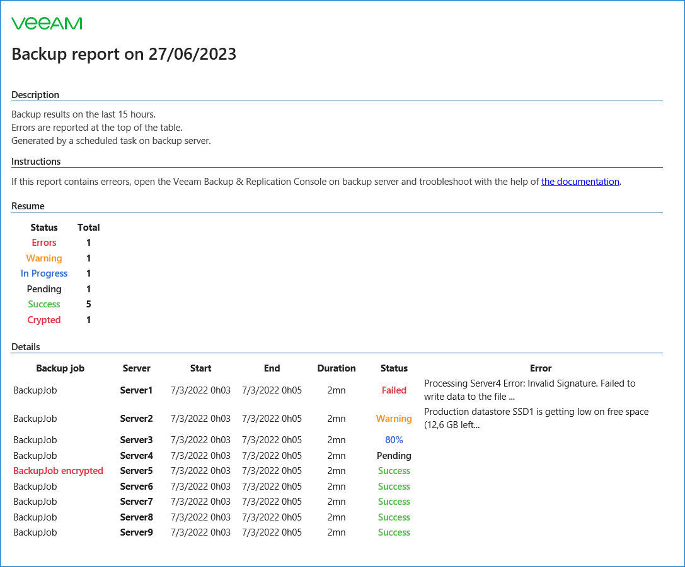

# Morning report


## Author
* Charly Froment

## Function
This script get the last backups results (the last 15 hours by default) and send it by email.

## Features
* Get results of VM backup jobs, agent backup jobs, backup copy jobs and tape jobs.
* Get errors from failed and warning jobs
* Signal crypted backup jobs to prevent involuntary crypted backups

## Known Issues
* *No known issues*

## Requirements
* Veeam Backup & Replication 11 (not tested on v12)
  
## Usage
Edit the parameters on top of the script, then you can start it.

```powershell
BR-MorningReport.ps1
```
