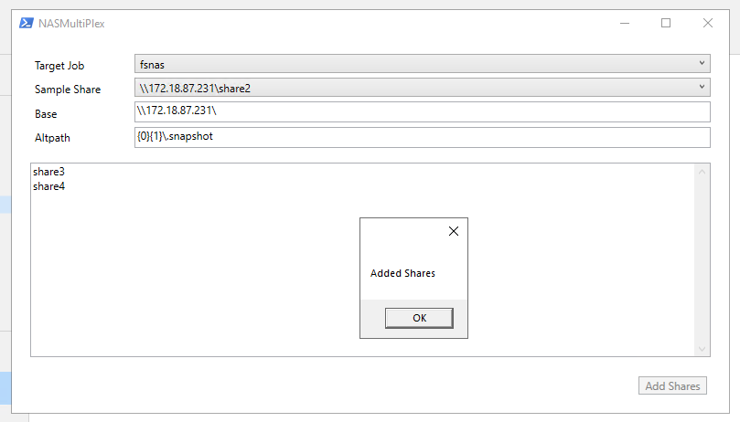

# Veeam NAS Multiplex
## VeeamHub
Veeamhub projects are community driven projects, and are not created by Veeam R&D nor validated by Veeam Q&A. They are maintained by community members which might be or not be Veeam employees. 

## Distributed under MIT license
Copyright (c) 2020 VeeamHub

Permission is hereby granted, free of charge, to any person obtaining a copy of this software and associated documentation files (the "Software"), to deal in the Software without restriction, including without limitation the rights to use, copy, modify, merge, publish, distribute, sublicense, and/or sell copies of the Software, and to permit persons to whom the Software is furnished to do so, subject to the following conditions:

The above copyright notice and this permission notice shall be included in all copies or substantial portions of the Software.

THE SOFTWARE IS PROVIDED "AS IS", WITHOUT WARRANTY OF ANY KIND, EXPRESS OR IMPLIED, INCLUDING BUT NOT LIMITED TO THE WARRANTIES OF MERCHANTABILITY, FITNESS FOR A PARTICULAR PURPOSE AND NONINFRINGEMENT. IN NO EVENT SHALL THE AUTHORS OR COPYRIGHT HOLDERS BE LIABLE FOR ANY CLAIM, DAMAGES OR OTHER LIABILITY, WHETHER IN AN ACTION OF CONTRACT, TORT OR OTHERWISE, ARISING FROM, OUT OF OR IN CONNECTION WITH THE SOFTWARE OR THE USE OR OTHER DEALINGS IN THE SOFTWARE.

## Project Notes
**Author:** Timothy Dewin (@tdewin)

**Function:** Add shares from the root domain to the same job via a gui

**Requires:** Veeam Backup & Replication v10

**Usage:** 
Running the GUI (or right click in explorer and run with powershell)
```
.\br-nasmultiplex.ps1
```

Sourcing the code so you can use add-nasmultiplexshares manually
```
. .\BR-NASMultiplex\br-nasmultiplex.ps1 -nogui
```

**Parameters:**
* -nogui : Just load the script but don't start the gui. If you source the code instead of running, you can than use Add-NasMultiplexShares to manually add multiple shares

**limitations:**
Exclusionmask are not copied from the referenceobject as they are generated objectspecific. Need extra verificationcode

**Sample:**


