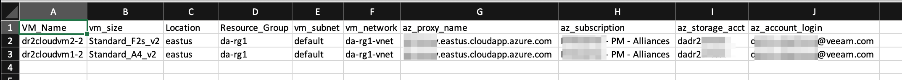
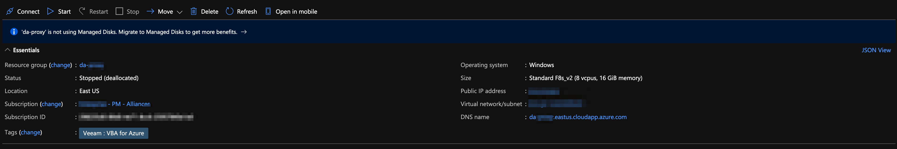
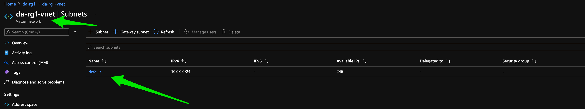
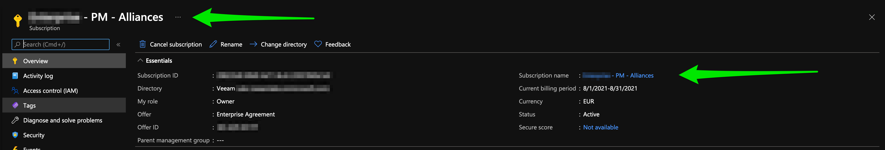
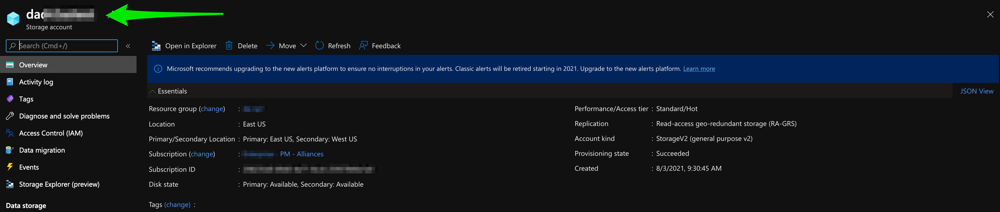

# Restore Multiple VMs to Microsoft Azure Script
## VeeamHub
Veeamhub projects are community driven projects, and are not created by Veeam R&D nor validated by Veeam Q&A. They are maintained by community members which might be or not be Veeam employees. 

## Distributed under MIT license
Copyright (c) 2016 VeeamHub

Permission is hereby granted, free of charge, to any person obtaining a copy of this software and associated documentation files (the "Software"), to deal in the Software without restriction, including without limitation the rights to use, copy, modify, merge, publish, distribute, sublicense, and/or sell copies of the Software, and to permit persons to whom the Software is furnished to do so, subject to the following conditions:

The above copyright notice and this permission notice shall be included in all copies or substantial portions of the Software.

THE SOFTWARE IS PROVIDED "AS IS", WITHOUT WARRANTY OF ANY KIND, EXPRESS OR IMPLIED, INCLUDING BUT NOT LIMITED TO THE WARRANTIES OF MERCHANTABILITY, FITNESS FOR A PARTICULAR PURPOSE AND NONINFRINGEMENT. IN NO EVENT SHALL THE AUTHORS OR COPYRIGHT HOLDERS BE LIABLE FOR ANY CLAIM, DAMAGES OR OTHER LIABILITY, WHETHER IN AN ACTION OF CONTRACT, TORT OR OTHERWISE, ARISING FROM, OUT OF OR IN CONNECTION WITH THE SOFTWARE OR THE USE OR OTHER DEALINGS IN THE SOFTWARE.

## Project Notes
**Author:** Dustin Albertson (@clouddizzle)

**Function:** This Script will take multiple inputs (vms) from a csv file and perform a restore to Azure process for each one.   

**Requires:** Veeam Backup & Replication v10 or v11

**Usage:** 

Edit the .csv file with the following information 

VM_NAME = Names of the machines from backups you wish to restore

vm_size = the VM type you want the instance to be in Azure (Standard_A4_v2)

Location = The location (region) you want the vm to be in (each vm can be in different locations)

Resource_Group = The resource group you want the vm to reside in

vm_subnet = The subnet you want the vm to use

vm_network = The vnet you want the vm to use

az_proxy_name = The proxy name of the veeam proxy appliance in azure. This is reccomended to improve performance. (learn more here = https://helpcenter.veeam.com/docs/backup/azure_integration/add_vbazure_appliance.html?ver=110)

az_subscription = The name of the subscription to restore to.  (each vm can be a different subscription)

az_storage_acct = The name of the storage account to restore to

az_account_login = The email address of the subscription used in veeam to connect to azure.  (each vm can be a different account/sub)

**CSV Example:** 

**Location of VPC ID:**

**Location of Subnet:**

**Location of subscriptions:**

**Location of Storage Group:**

Once you have the settings placed in the dr2azure.csv you can then edit the script to add the following settings

#Please Update the variables below 
$vbrserver = “localhost”
#VBR ServerName
$vbruser = “USERNAME”
#VBR Username
$vbrpwd = “PASSWORD”
#VBR Password
$cust_csv = "C:/example/dr2ec2.csv"
#Location of the csv file with the AWS/vm details

Once these settings have been added you simply run the powershell script from the console by ./dr2azure.ps1

