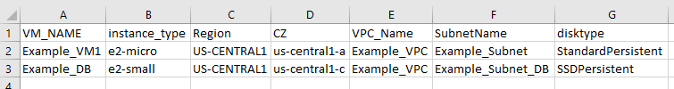
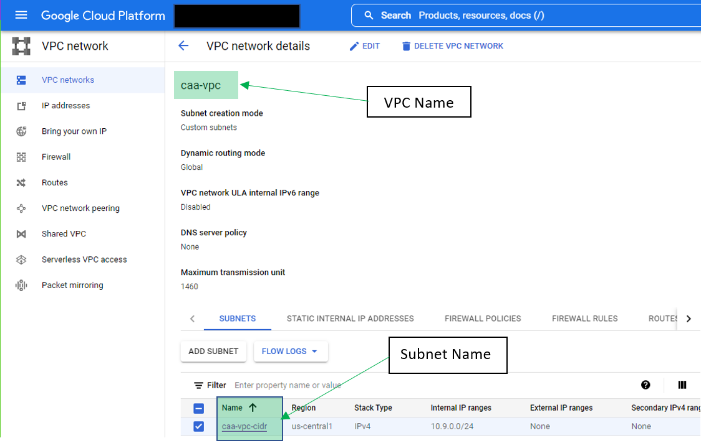

# Restore Multiple VMs to Google Cloud Engine Script
## VeeamHub
Veeamhub projects are community driven projects, and are not created by Veeam R&D nor validated by Veeam Q&A. They are maintained by community members which might be or not be Veeam employees. 

## Distributed under MIT license
Copyright (c) 2016 VeeamHub

Permission is hereby granted, free of charge, to any person obtaining a copy of this software and associated documentation files (the "Software"), to deal in the Software without restriction, including without limitation the rights to use, copy, modify, merge, publish, distribute, sublicense, and/or sell copies of the Software, and to permit persons to whom the Software is furnished to do so, subject to the following conditions:

The above copyright notice and this permission notice shall be included in all copies or substantial portions of the Software.

THE SOFTWARE IS PROVIDED "AS IS", WITHOUT WARRANTY OF ANY KIND, EXPRESS OR IMPLIED, INCLUDING BUT NOT LIMITED TO THE WARRANTIES OF MERCHANTABILITY, FITNESS FOR A PARTICULAR PURPOSE AND NONINFRINGEMENT. IN NO EVENT SHALL THE AUTHORS OR COPYRIGHT HOLDERS BE LIABLE FOR ANY CLAIM, DAMAGES OR OTHER LIABILITY, WHETHER IN AN ACTION OF CONTRACT, TORT OR OTHERWISE, ARISING FROM, OUT OF OR IN CONNECTION WITH THE SOFTWARE OR THE USE OR OTHER DEALINGS IN THE SOFTWARE.

## Project Notes
**Author:** Cody Ault (@codyault)

**Function:** This Script will take multiple inputs (vms) from a csv file and perform a restore to GCE process for each one.   

**Requires:** Veeam Backup & Replication v11a

**Usage:** 

Edit the .csv file with the following information 

VM_Name = Names of the machines from backups you wish to restore

instance_type = the instance type you want the instance to be in GCE (example e2-micro )

Region = The region you want the instance to be in (each instance can be in different regions)

CZ = The Compute Zone you want the instance to be in (Each instance can be in a different CZ)

VPC_Name = The name of the VPC (found via the Google Cloud console - see image below)

SubnetName = The name of the Subnet in the VPC you want the instance to use (found via the Google Cloud console - see image below)

diskType = This is the type/class of disk you want to restore each machine as. Some VMs might require higher class disks such as ssd

**CSV Example:** 

**Location of VPC-Subnet:**

Once you have the settings placed in the dr2GCE.csv you can then edit the script to add the following settings

#Please Update the variables below 
$vbrserver = “localhost”
#VBR ServerName
$vbruser = “USERNAME”
#VBR Username
$vbrpwd = “PASSWORD”
#VBR Password
$Account = "ACCOUNT-NAME"
#Account from Cloud Credential in VBR (IE the cloud account you wish to use)
$cust_csv = "C:/example/dr2ec2.csv"
#Location of the csv file with the GCE/vm details

Once these settings have been added you simply run the powershell script from the console by ./dr2gce.ps1

