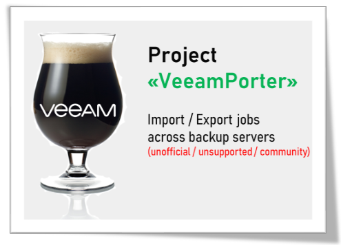

# Project "VeeamPorter"
Powershell Script to Import/Export jobs across Veeam Backup Servers

**Please note this script is unofficial and is not created nor supported by Veeam Software.**

## Description
~~~~
Version : 0.81 (September 11th, 2019)
Requires: Veeam Backup & Replication v9.5 Update 4 or later
Author  : Danilo Chiavari (@danilochiavari)
Blog    : https://www.danilochiavari.com
~~~~

This script copies backup jobs across different backup servers, allowing you to "transfer" them without doing a full Configuration Restore.
Before use, please make sure source and target Veeam Backup Server have the same virtual infrastructure(s) configured and the same proxies/repositories.
For help or comments, contact the author on Twitter (@danilochiavari) or via e-mail (danilo.chiavari -at- gmail (.) com)

This script has been tested only with the following versions of Veeam Backup & Replication:
- v9.5 Update 4   (build 9.5.4.2615)
- v9.5 Update 4a  (build 9.5.4.2753)
- v9.5 Update 4b  (build 9.5.4.2866)

Current Limitations:
- Only primary Backup Jobs are currently supported (no Backup Copy Jobs, no Replication Jobs, no SureBackup Jobs, etc.)
- Only VMware vSphere platform is currently supported (no Hyper-V jobs, no Windows/Linux Agents Jobs, etc.)

## Before you use the script

Make sure the Source and Target Veeam Backup Servers are at the same version / build.

Have the target Veeam Backup Server and Infrastructure already configured, with the required components in place (virtual infrastructures, proxies, repositories, etc. referenced in the original jobs you are importing).

The script has some degree of "resilience" and allows for minor differences between environments (for example, if a repository with the same name as the source job's is not found, it allows you to select a different one), but the more similar they are, the better.

## Features

- You can select multiple jobs to be imported/exported at once (`SHIFT+Click`, `CTRL+Click`) 
- All types of objects / containers (folders, tags, datastores, hosts, clusters, vCenter servers, etc.) are supported
- All options and properties (Storage options, Guest Processing options, Schedule, Credentials, etc.) are copied along with the job
- All types of exclusions (VM-level, single virtual disk level) are copied along with the job
- Every run is fully logged, in a sub-folder named `Logs` under the script's path (if necessary, the script will create it automatically). The file name format is `VeeamPorter-YYYYMMDD_HHMM.txt`
- Current credentials (logged on user who is running the script) will be tried for connecting to source and target Veeam Backup Servers. If logon fails, the script will automatically ask for credentials and use them from that moment onwards
- All imported jobs are disabled by default (but schedule options are fully retained). This behaviour is the same as when jobs are cloned from the GUI. The only exception is for jobs without a schedule: they are left **enabled** otherwise the user won't be able to enable them in the GUI (button will be grayed out). *(This is because GUI does not allow you to enable or disable jobs without a schedule, while Powershell does)*
- Backup Proxies, Guest Interaction Proxies: the script will try to copy settings from the source as faitfhully as possible. If one or more components are not found at target, only the ones that are found will be enabled. If none of the source components are found at target, automatic selection will be enabled. *(the script will log a warning about this)*
- Guest Credentials: if the job-level guest credentials are not found at target, App-Aware processing and Indexing are disabled *(the script will log a warning about this)*. If specific VM/object-level guest credentials are not found at target, they will simply be discarded (silently) and the default (same credentials as job-level) will be used
- Backup Files Encryption: if encryption is enabled in the source job, the script prompts the user to choose among the  encryption passwords available at the target Veeam Backup Server. If no key exists, the user can create one directly from the script or choose to create the target job with encryption disabled
- Repositories: both simple and scale-out repositories are supported. If a repository with the same name as the source does not exist at the target Veeam Backup Server, the script lets the user select a repository among the ones available at the target (both simple and SOBR)
- If Job Chaining is used ("Run after...") at the source, the script will try to replicate the schedule chain at the target (adding the suffix, if any, to the job names). For example, if `job02` is scheduled after `job01` at the source, the script will try to schedule `job02_imported` (if default suffix is used) after `job01_imported`. If the previous job in the chain is not found at the target, the job will be imported with the schedule disabled

## Parameters
`target_srv`
_(mandatory)_ The target Veeam Backup Server where jobs will be created/imported. Either host name or IP address can be used.

`source_srv`
_(optional)_ The source Veeam Backup Server from where jobs will be exported. If it is not specified, local machine (localhost) is assumed.

`job_suffix`
_(optional)_ Suffix to be appended to job names created in the target Veeam Backup Server. If it is not specified, "_imported" is used. Can be set to `$null` if you don't want to use a suffix.

## Examples
`PS> .\veeamporter.ps1 -source_srv SOURCESERVER -target_srv TARGETSERVER`

`PS> .\veeamporter.ps1 -source_srv OLDSERVER -target_srv NEWSERVER -job_suffix "_new"`

`PS> .\veeamporter.ps1 -target_srv NEWSERVER -job_suffix $null`
