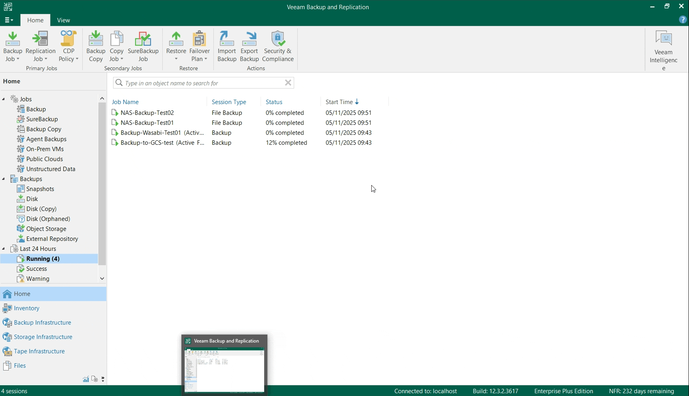

# theVeeamReaper 🔪

[](https://docs.microsoft.com/en-us/powershell/)


A PowerShell script for interactively displaying currently running Veeam Backup & Replication jobs and terminating them immediately in a forceful fashion (by killing the associated Veeam.Backup.Manager.exe processes).

🤖 This script was developed with the help of Artificial Intelligence (AI).

## ⚠️ IMPORTANT NOTES ⚠️
- **This script is unofficial and is not created nor supported by Veeam Software.**
- Forceful termination of running jobs (which is what the script allows you to do) can potentially lead to inconsistencies in the backup chains. **Caution is advised.**

## Features

- Automatically loads the Veeam PowerShell module if not already loaded.
- Compatible with both Windows PowerShell and PowerShell 7+.
- Detects running Veeam jobs and displays details (name, platform, elapsed time, completion percent).
- Allows selection of multiple jobs to investigate/terminate via a GridView.
- Identifies Veeam.Backup.Manager.exe processes linked to selected jobs.
- Displays the processes to be terminated, including Process Name, PID, Job Name, and arguments.
- Prompts for confirmation before terminating processes.


## Requirements

- Works only with **Windows-based** Veeam Backup & Replication servers (tested on v12.3.x)
- **PowerShell 5.1+** or higher (GridView requires Windows PowerShell ISE or full console)
- The script needs to be run **locally** on the VBR server, with **administrator rights**

## Usage

1. Open PowerShell **as Administrator** on the Veeam server.
2. Run the script:
    ```powershell
    .\theVeeamReaper.ps1
    ```
3. Select running jobs in the first GridView (multi-select works: `SHIFT+Click`, `CTRL+Click`).
4. Review the associated processes in the console table.
5. Confirm to terminate the listed processes.

## Output Example



## About
- Author: Danilo Chiavari (@DChiavari)
- E-mail for feedback: (name -dot- surname -at- veeam.com)
- Version: 1.0 (November 5th, 2025)
