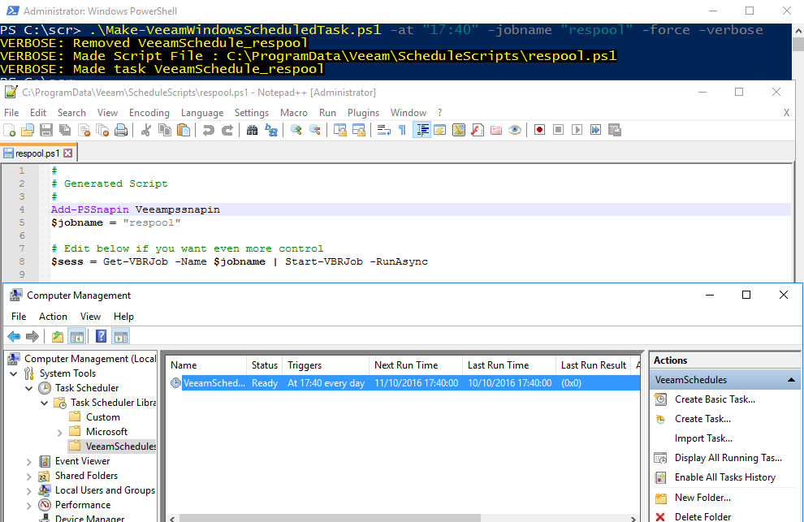

# Make Veem Windows Scheduled Task
## VeeamHub
Veeamhub projects are community driven projects, and are not created by Veeam R&D nor validated by Veeam Q&A. They are maintained by community members which might be or not be Veeam employees.

## Distributed under MIT license
Copyright (c) 2016 VeeamHub

Permission is hereby granted, free of charge, to any person obtaining a copy of this software and associated documentation files (the "Software"), to deal in the Software without restriction, including without limitation the rights to use, copy, modify, merge, publish, distribute, sublicense, and/or sell copies of the Software, and to permit persons to whom the Software is furnished to do so, subject to the following conditions:

The above copyright notice and this permission notice shall be included in all copies or substantial portions of the Software.

THE SOFTWARE IS PROVIDED "AS IS", WITHOUT WARRANTY OF ANY KIND, EXPRESS OR IMPLIED, INCLUDING BUT NOT LIMITED TO THE WARRANTIES OF MERCHANTABILITY, FITNESS FOR A PARTICULAR PURPOSE AND NONINFRINGEMENT. IN NO EVENT SHALL THE AUTHORS OR COPYRIGHT HOLDERS BE LIABLE FOR ANY CLAIM, DAMAGES OR OTHER LIABILITY, WHETHER IN AN ACTION OF CONTRACT, TORT OR OTHERWISE, ARISING FROM, OUT OF OR IN CONNECTION WITH THE SOFTWARE OR THE USE OR OTHER DEALINGS IN THE SOFTWARE.

## Project Notes
**Author:** Timothy Dewin @tdewin

**Function:** Will create a powershell script file under %programdata%\ScheduleScripts and makes a Windows task that will run the powershell script. Removes the burden of figuring out how to start Powershell scripts from the task scheduler. You can edit the schedulescripts if you want to make  special scheduling requirements e.g.

**Special Schedules Examples:**
Jobname is inserted as static text in the variable $jobname at the top (not via the task scheduler). Thus every job has it's unique script file. If you want to make a customization for every job, you can easily modify this script and change the content while generating the scripts.

*Regular Run (will be generated in the script file by default)*
```powershell  
$sess = Get-VBRJob -Name $jobname | Start-VBRJob -RunAsync
```

*Specific Day In The Month*
```powershell   
$now = (get-date)
if ($now.Day -eq 10) {
    $sess = Get-VBRJob -Name $jobname | Start-VBRJob -RunAsync
}
```

*Full Backup every 2 weeks (alternating)*
```powershell  
$week = (get-date -UFormat %V)
#You can of course skip week check if you run the script only on Friday (-DayOfWeek Friday)
if ((get-date).DayOfWeek -eq [System.DayOfWeek]::Friday -and ($week%2) -eq 1) {
    $sess = Get-VBRJob -Name $jobname | Start-VBRJob -RunAsync -FullBackup
}
```


**Example:**



**Requires:** Veeam Backup & Replication v9

**Usage:**

Make-VeeamWindowsScheduledTask.ps1 -jobname "jobname" -at "22:00" -verbose -force

**Parameters:**

* -Jobname
	* Name of job
* -At
	* What hour every Day

*More Optional parameters*
* -force
  * Overwrites existing script/schedule
* -verbose
	* Outputs where the script file was made
* -DayOfWeek
	* Allows you to pass a parameter which defines when days to run
* -scriptpath
	* <Programdata>\Veeam\ScheduleScripts
* -scriptfile
	* Job dervied name
* -schedulename
	* VeeamSchedule_<job derived>
* -schedulepath
	* Folder in the task scheduler (For group schedules)
