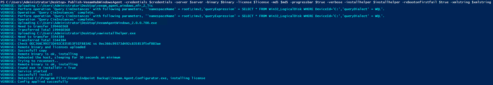

# Make Veem Windows Scheduled Task
## VeeamHub
Veeamhub projects are community driven projects, and are not created by Veeam R&D nor validated by Veeam Q&A. They are maintained by community members which might be or not be Veeam employees.

## Distributed under MIT license
Copyright (c) 2016 VeeamHub

Permission is hereby granted, free of charge, to any person obtaining a copy of this software and associated documentation files (the "Software"), to deal in the Software without restriction, including without limitation the rights to use, copy, modify, merge, publish, distribute, sublicense, and/or sell copies of the Software, and to permit persons to whom the Software is furnished to do so, subject to the following conditions:

The above copyright notice and this permission notice shall be included in all copies or substantial portions of the Software.

THE SOFTWARE IS PROVIDED "AS IS", WITHOUT WARRANTY OF ANY KIND, EXPRESS OR IMPLIED, INCLUDING BUT NOT LIMITED TO THE WARRANTIES OF MERCHANTABILITY, FITNESS FOR A PARTICULAR PURPOSE AND NONINFRINGEMENT. IN NO EVENT SHALL THE AUTHORS OR COPYRIGHT HOLDERS BE LIABLE FOR ANY CLAIM, DAMAGES OR OTHER LIABILITY, WHETHER IN AN ACTION OF CONTRACT, TORT OR OTHERWISE, ARISING FROM, OUT OF OR IN CONNECTION WITH THE SOFTWARE OR THE USE OR OTHER DEALINGS IN THE SOFTWARE.

## Project Notes
**Author:** Timothy Dewin @tdewin

**Function:** Will deploy the Veeam Agent for Windows 2.0 over powershell



Start by importing the module
```powershell
import-Module .\VeeamHubWindowsAgentDeploy.psm1
```

```powershell  
Install-VeeamHubWindowsAgent -credentials $credentials -server $server -binary $binary -license $license -md5 $md5 -progressbar $true -verbose -installhelper $installhelper -rebootonfirstfail $true -xmlstring $xmlstring
```

*Parameters*
* -server
  * IP or DNS of target
* -credentials
  * Use get-credential to get password (if not supplied, uses the current account)
* -verbose
	* outputs more info
* -installhelper
	* path to vawinstallhelper.exe (supplied)
* -binary
	* Installer file (probably VeeamAgentWindows_2.0.0.700.exe)
* -license
	* License (.lic) file
* -md5
	* File with md5 hash for binary
* -xmlstring
	* XML config dumped from a previous installation (optionally)
* -progressbar
	* Show progressbar (optionally)
	
VAWInstallhelper helps deploy VAW. Dotnet version 4.5.2 can not installed over powershell. VAWInstallhelper is a fake service that will do the installation instead of executing it in powershell

VAWInstallhelper Go code can be found here:
https://github.com/tdewin/vawinstallhelper
