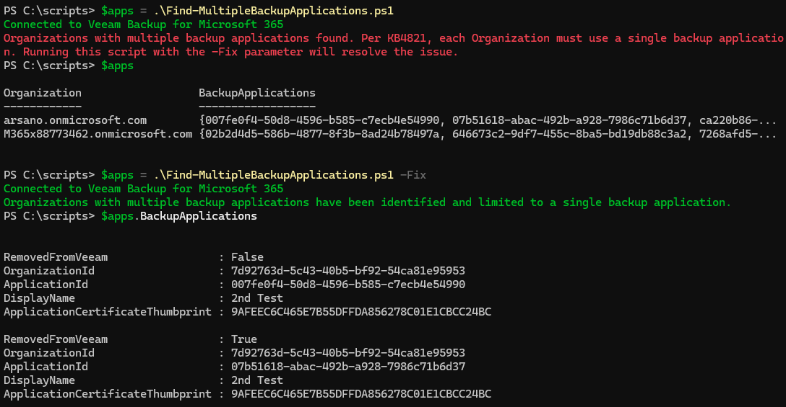

# KB4821 - Identify & Fix Organizations with multiple backup applications

## Author

Chris Arceneaux (@chris_arceneaux)

## Function

Per KB4821, each Organization should use a single backup application per Microsoft term's of use and product documentation. This script identifies Organizations that are using multiple backup applications.

If the `-Fix` flag is specified, Organizations with 2+ backup applications will have all but 1 backup applications removed.

## Known Issues

* *None*

## Requirements

* Veeam Backup for Microsoft 365 7+
* Script must be executed on the Veeam Backup for Microsoft 365 server

#### Usage

`Get-Help .\Find-MultipleBackupApplications.ps1 -Full

