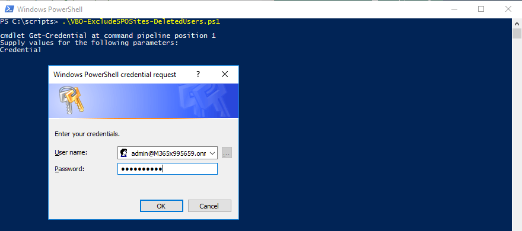
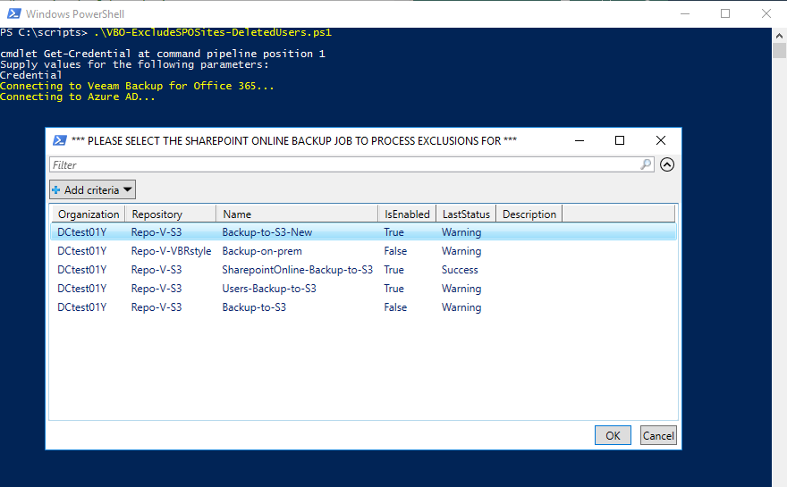
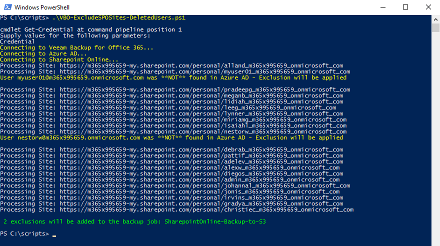
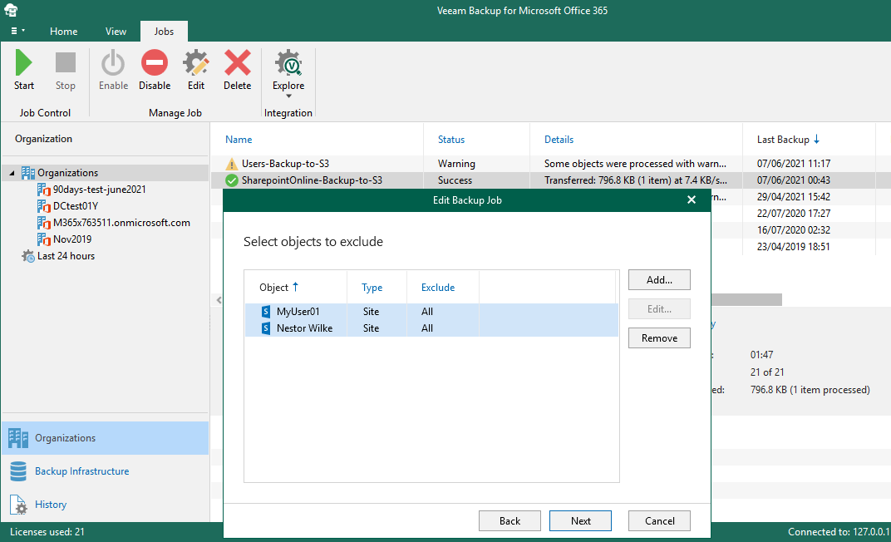

# VBO-ExcludeSPOSites-DeletedUsers
Powershell Script to automatically exclude from backup Sharepoint Online personal sites belonging to deleted users.

**Please note this script is unofficial and is not created nor supported by Veeam Software.**

## Description
~~~~
Version : 0.9 (July 27th, 2021)
Requires: Veeam Backup for Office 365 v4 or later
Author  : Danilo Chiavari (@danilochiavari)
Blog    : https://www.danilochiavari.com
GitHub  : https://www.github.com/dchiavari
~~~~

For help or comments, contact the author on Twitter (@danilochiavari) or via e-mail (danilo.chiavari -at- gmail (.) com)

This script has been tested only with the following versions of Veeam Backup for Office 365:
- v5.0.1.225

## Notes
- You will be prompted to log in to Azure AD. You can use either a standard credential or one secured by Multi-Factor Authentication (MFA). See "Parameters" and "Examples" below
- Organization / Office 365 Tenant and Sharepoint Online Admin URLs are automatically obtained based on the logged on user

## Before you use the script

The script is designed to be run locally, from the Veeam Backup for Office 365 server. 

Before starting, please make sure you have the two additional required Powershell modules:
- **Sharepoint Online** _(Microsoft.Online.SharePoint.PowerShell)_
- **Azure AD** _(AzureAD)_

You can easily find these modules at https://www.PowershellGallery.com. 

Installation can be done directly from an administrative Powershell session:

`PS> Install-Module -Name Microsoft.Online.SharePoint.PowerShell`

`PS> Install-Module -Name AzureAD`

NOTE: you can encounter errors during installation of the NuGet package and/or the Powershell modules. This is usually solved by forcing Powershell to use TLS 1.2:

`PS> [Net.ServicePointManager]::SecurityProtocol = [Net.SecurityProtocolType]::Tls12`

NOTE: you might need to manually specify that you “trust” the PSGallery repository, as it is “untrusted” by default. If you want, you can set it to trusted with the following command:

`PS> Set-PSRepository -Name 'PSGallery' -InstallationPolicy Trusted`

## Parameters
`Job`
_(optional)_ The backup job where exclusions will be created. If not specified (or the provided one does not exist) the script will let you pick from a list of existing jobs for the selected Organization (via Out-GridView, see screenshots)

`MFA`
_(optional)_ When set to $True, allows use of a MFA-secured user account when logging in. If not specified, a standard (non-MFA) user account is assumed _(Thanks to user @kosli for implementing and testing MFA, plus fixing an issue with obtaining admin URLs)_

## Examples
`PS> .\VBO-ExcludeSPOSites-DeletedUsers.ps1 -MFA $True`

`PS> .\VBO-ExcludeSPOSites-DeletedUsers.ps1 -Job MyBackupJob`

`PS> .\VBO-ExcludeSPOSites-DeletedUsers.ps1 -Job MyBackupJob -MFA $True`

## Screenshots

## Acknowledgments
Thanks to the following people for their time and effort in testing and improving this script:
* __[KoS](https://github.com/kosli)__ (MFA implementation, admin URL construction)
* __Tom De Puysseleyr__ (Fix for default partial results of `Get-AzureADUser` and `Get-SPOSite`)
