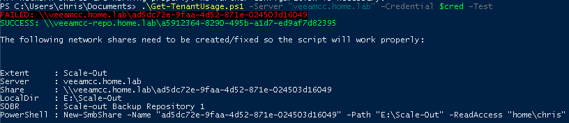
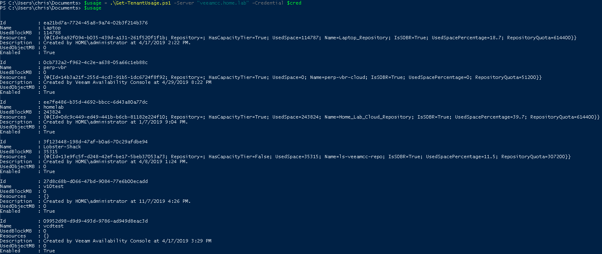

# Veeam Cloud Connect Tenant Usage

## Author

Chris Arceneaux (@chris_arceneaux)

## Function

This script will allow you to pull VCC tenant usage including space used in Backup Repositories and SOBR, including Performance ***Capacity*** Tiers.

## Known Issues

* _None_

## Requirements

* Veeam Cloud Connect
  * Veeam Backup & Replication 9.5 Update 4 *(might work with previous versions but untested)*
  * Veeam Backup Administrator account
* Network shares (CIFS/SMB) to be created for *each* SOBR extent
  * A `-Test` function has been created to help setup/test each network share
  * Read-Only access is required
  * Same account used Veeam Cloud Connect must have access to the network shares
* Script can be executed from the following locations:
  * Veeam Backup & Replication server
  * Server with the Veeam Backup & Replication Console installed
* Network connectivity
  * The server executing the script needs to be able to access all network shares and the Veeam Backup & Replication server

## Installation

Network shares must be configured for *each* SOBR extent. Below are instructions providing an easy method for setting things up.

* First run the `Get-TenantUsage.ps1` script specifying the `-Test` flag:

```powershell
Get-TenantUsage.ps1 -Server "vbr.contoso.local" -Credential (Get-Credential) -Test
```

* Use the output as your checklist for all network shares you need to create.



* **[Windows]** As seen in the screenshot above, I've included a *PowerShell* command to ease creation of the network share. Executing the PowerShell code on the Backup Repository server where the extent is located will create the network share with the required permissions.

* **[Linux]** You'll want to setup Samba file shares to mimic the same functionality of Windows CIFS shares.
  * Another option would be to enable Windows NFS support in the server executing the script and then setup NFS shares on your Linux Backup Repository servers. Finally, you'd need to modify the PowerShell code accordingly to account for the change.

## Usage

Get-Help .\Get-TenantUsage.ps1

The output of the script is a multi-layered PSObject with all the necessary information to pull Cloud Connect Tenant usage from Backup Repositories *(block)* and SOBR, including both Performance *(block)* & Capacity *(object)* Tiers.

The key parameters you want is:

* **UsedBlockMB:** Standard Backup Repositories and SOBR Performance Tier
* **UsedObjectMB:** SOBR Capacity Tier

Here is a sample output:

