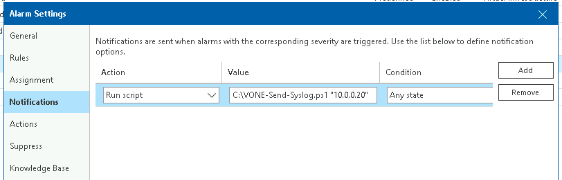

# Exporting M365 Mailbox to PST

## Author

* Jorge de la Cruz (@jorgedlcruz)

## Function

This script enables Veeam ONE alarm status updates to be sent to a Syslog server. It's set at the Alarm-level as specified [in Veeam documentation](https://helpcenter.veeam.com/docs/one/monitor/alarm_notifications.html?ver=120).

## Known Issues

* *No known issues*

## Requirements

* Veeam ONE v12
  * *Other versions are untested*

## Usage

When defining the script in Veeam ONE, you must include the Syslog server IP or FQDN. Ex: `C:\VONE-Send-Syslog.ps1 "10.0.0.20"`

