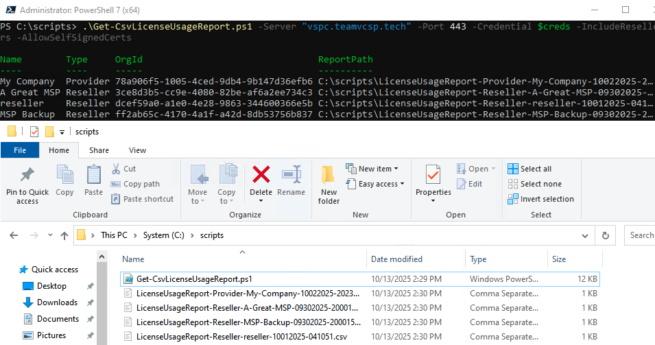

# Veeam Service Provider Console (VSPC) Retrieve CSV License Usage Report

## Author

Chris Arceneaux (@chris_arceneaux)

## Function

This script will retrieve the most recent monthly license usage report for the service provider from the Veeam Service Provider Console in the CSV format. If the `IncludeResellers` flag is present, a CSV report will also be downloaded for each reseller.

#### Known Issues

* *None*

#### Requirements

* Veeam Service Provider Console v9
  * Portal Administrator account used to access the REST API
* Network connectivity
  * The machine executing the script needs to be able to access the VSPC REST API
* PowerShell Core

#### Usage

The script contains built-in documentation including examples!

Get-Help .\Get-CsvLicenseUsageReport.ps1 -Full

