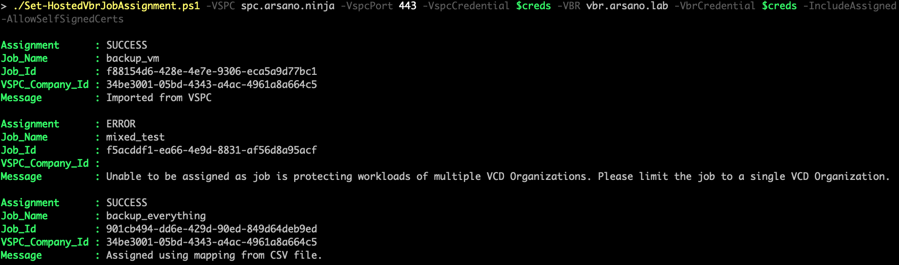

# Veeam Service Provider Console (VSPC) Hosted Usage Scripts

## Author

Chris Arceneaux (@chris_arceneaux)

## Function

Veeam Service Provider Console v8 includes enhanced support for hosted Veeam Backup & Replication servers. Scripts located here expand on this already amazing feature! See below for a list of scripts in this collection and their function:

* [Sync-VcdOrganizationMapping.ps1](#sync-vcdorganizationmappingps1)
* [Set-HostedVbrJobAssignment.ps1](#set-hostedvbrjobassignmentps1)
* [Get-VspcHostedUsage.ps1](#get-vspchostedusageps1)

### Sync-VcdOrganizationMapping.ps1

This script identifies VMware Cloud Director (VCD) Organizations using the specified Veeam Backup & Replication (VBR) server and then attempts to map each Organization to a Veeam Service Provider Console (VSPC) Company. Mappings are stored in a CSV file (`VcdOrganizationMapping.csv`). Organizations that cannot be mapped will be identified in the output.

Four different methods of mapping are available:

1. `cloud_connect`: VCD-backed Cloud Connect Tenants
2. `name`: Identical names (VCD Organization/VSPC Company)
3. `different_vspc`: Mapping from already existing mappings (different VSPC servers)
4. `manual`: Manual (outside of script)

Any organization mapping that cannot be completed using methods 1-3 will be listed as `INCOMPLETE` and must be mapped manually using the CSV file.

#### Known Issues

* A single backup job that protects workloads from *multiple VCD environments* or *multiple VCD Organizations* is not supported.
  * FIX: Ensure that each job is protecting a single VCD environment & Organization. Veeam makes it easy to split up jobs by [moving protected workloads to a new job](https://helpcenter.veeam.com/docs/backup/vsphere/backup_moving.html?ver=120#how-moving-to-another-job-works).

#### Requirements

* Veeam Service Provider Console v8
  * Portal Administrator account used to access the REST API
* Veeam Backup & Replication v12.1
  * Backup Administrator account used to access the REST API
* Network connectivity
  * The server executing the script needs to be able to access the VSPC REST API and the VBR REST API
* PowerShell Core

#### Usage

Get-Help .\Sync-VcdOrganizationMapping.ps1

### Set-HostedVbrJobAssignment.ps1

This script assigns hosted Veeam Backup & Replication (VBR) server backup jobs to a Veeam Service Provider Console (VSPC) Company. It first identifies VMware Cloud Director (VCD) backup jobs on the specified VBR server. Then, it ensures the job protects a single VCD Organization. Finally, it assigns the job to a VSPC Company.

Any job that cannot be assigned will be listed as `ERROR` and will include a message with more information.

***Please note that a CSV mapping file is required. This file can be generated using the [Sync-VcdOrganizationMapping.ps1](#sync-vcdorganizationmappingps1) script located in this collection.***

#### Known Issues

* *None*

#### Requirements

* Veeam Service Provider Console v8
  * Portal Administrator account used to access the REST API
* Veeam Backup & Replication v12.1
  * Backup Administrator account used to access the REST API
  * Specified server must be a *Hosted* server in VSPC. [See Veeam documentation for more information.](https://helpcenter.veeam.com/docs/vac/provider_admin/connect_backup_servers.html?ver=80#hosted)
* `VcdOrganizationMapping.csv`: CSV file mapping a VCD Organization to a VSPC Company
* Network connectivity
  * The server executing the script needs to be able to access the VSPC REST API and the VBR REST API
* PowerShell Core

#### Usage

Get-Help .\Set-HostedVbrJobAssignment.ps1

### Get-VspcHostedUsage.ps1

This script will return point in time usage for VMware Cloud Director (VCD) backup jobs. Usage is separated for each VSPC Company.

For usage report numbers to be accurate and holistic, **all** hosted Veeam Backup & Replication (VBR) servers must have a *Healthy* connection to VSPC and **all** VCD backup jobs must be assigned to a VSPC Company. Script will provide a warning(s) if this is not the case.

#### Known Issues

* *None*

#### Requirements

* Veeam Service Provider Console v8
  * Portal Administrator account used to access the REST API
* Veeam Backup & Replication v12.1
* Network connectivity
  * The server executing the script needs to be able to access the VSPC REST API
* PowerShell Core

#### Usage

Get-Help .\Get-VspcHostedUsage.ps1

