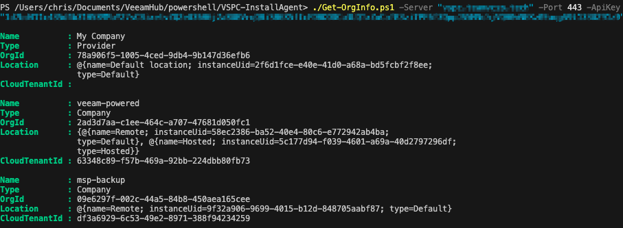

# Veeam Service Provider Console (VSPC) Download Management Agent Scripts

## Author

Chris Arceneaux (@chris_arceneaux)

## Function

This collection of scripts serve as an example on how to download a management agent from VSPC. Perusing the scripts, you'll see there are two main components:

### 1. Gathering information on the Organization

The purpose of the `Get-OrgInfo.ps1` script is to retrieve information that is required to be able to download a management agent. In order to download a management agent, thet following information is required:

1. Organization UID
2. Location UID
3. Cloud Connect Tenant UID
   * In a _hosted_ scenario where Cloud Connect is not involved, this field may be left undefined.

_Note: There are 3 different types of organizations: Service Provider, Reseller, Company. This script does not return information for a reseller organization as a management agent cannot be assigned to a reseller._

### 2. Download the Management Agent

In v9, VSPC supports managements agents for the following Operating Systems:

* [Windows OS](https://helpcenter.veeam.com/rn/vspc_9_release_notes.html#system-requirements-veeam-management-agents-windows-os)
* [Linux OS](https://helpcenter.veeam.com/rn/vspc_9_release_notes.html#system-requirements-veeam-management-agents-linux-os)
* [macOS](https://helpcenter.veeam.com/rn/vspc_9_release_notes.html#system-requirements-veeam-management-agents-macos)

In line with that, here are sample scripts demonstrating how to download the management agent:

* [Get-MgmtAgentWindows.ps1](Get-MgmtAgentWindows.ps1)
* [Get-MgmtAgentLinux.ps1](Get-MgmtAgentLinux.ps1)
* [Get-MgmtAgentMac.ps1](Get-MgmtAgentMac.ps1)

#### Known Issues

* *None*

#### Requirements

* Veeam Service Provider Console v9
* API key
  * A read-only API key is sufficient.
  * [Reference information on how to generate an API key.](https://helpcenter.veeam.com/docs/vac/provider_admin/api_keys.html)
* Network connectivity
  * The machine executing the script needs to be able to access the VSPC REST API
* PowerShell Core

#### Usage

All scripts in this collection contain built-in documentation including examples!

Get-Help .\Get-OrgInfo.ps1

Get-Help .\Get-MgmtAgentWindows.ps1

Get-Help .\Get-MgmtAgentLinux.ps1

Get-Help .\Get-MgmtAgentMac.ps1

