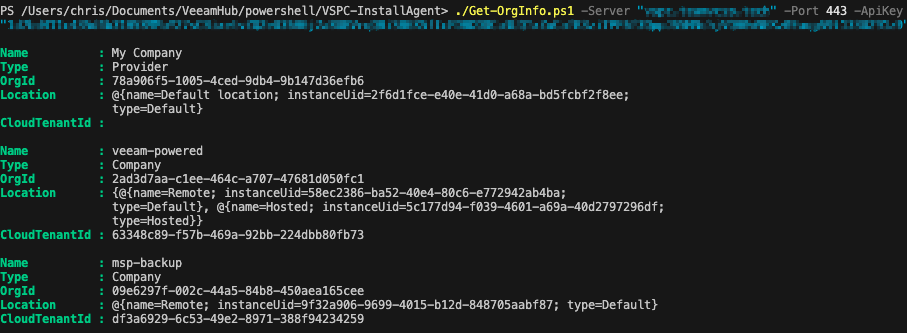
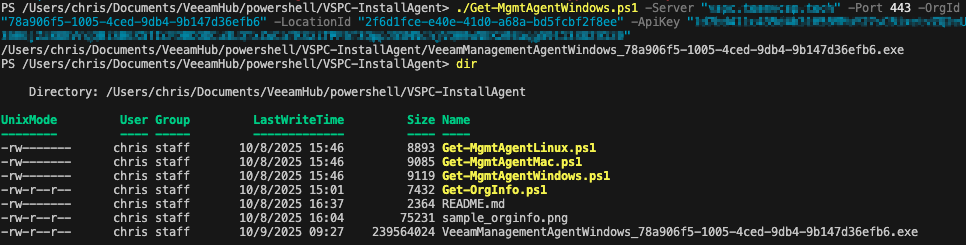

# Veeam Service Provider Console (VSPC) Management Agent Scripts

## Author

Chris Arceneaux (@chris_arceneaux)

## Function

The VSPC management agent acts as a communication bridge between VSPC itself and remote servers. This collection of scripts serve as an example on how to download a management agent from VSPC and install it on remote servers. Perusing the scripts, you'll see there are 3 main components:

### 1. Gathering information on the Organization

The purpose of the [Get-OrgInfo.ps1](Get-OrgInfo.ps1) script is to retrieve information that is required to be able to download a management agent. In order to download a management agent, thet following information is required:

1. Organization UID
2. Location UID
3. Cloud Connect Tenant UID
   * In a _hosted_ scenario where Cloud Connect is not involved, this field is not required.

_Note: There are 3 different types of organizations: Service Provider, Reseller, Company. This script does not return information for a reseller organization as a management agent cannot be assigned to a reseller._

### 2. Downloading the Management Agent

In v9, VSPC supports management agents for the following Operating Systems:

* [Windows OS](https://helpcenter.veeam.com/rn/vspc_9_release_notes.html#system-requirements-veeam-management-agents-windows-os)
* [Linux OS](https://helpcenter.veeam.com/rn/vspc_9_release_notes.html#system-requirements-veeam-management-agents-linux-os)
* [macOS](https://helpcenter.veeam.com/rn/vspc_9_release_notes.html#system-requirements-veeam-management-agents-macos)

In line with that, here are sample scripts demonstrating how to download the management agent:

* [Get-MgmtAgentWindows.ps1](Get-MgmtAgentWindows.ps1)
* [Get-MgmtAgentLinux.ps1](Get-MgmtAgentLinux.ps1)
* [Get-MgmtAgentMac.ps1](Get-MgmtAgentMac.ps1)

### 3. Installing the Management Agent

The documentation listed below contains any commands/parameters required for a silent unattended install of the management agent. Additionally, there is a sample script demonstrating how to install the management agent on the Windows OS.

* [Windows OS](https://helpcenter.veeam.com/docs/vac/deployment/silent_install_agent.html)
  * [Install-MgmtAgentWindows.ps1](Install-MgmtAgentWindows.ps1)
* [Linux OS](https://helpcenter.veeam.com/docs/vac/deployment/silent_install_agent_lin.html)
* [macOS](https://helpcenter.veeam.com/docs/vac/deployment/silent_install_agent_mac.html)

#### Known Issues

* `Install-MgmtAgentWindows.ps1` - As written, it only supports installation of a management using an MSI file. If planning on using the script, be sure to download an MSI when using `Get-MgmtAgentWindows.ps1`.

#### Requirements

* Scripts that interact with VSPC API (steps 1 & 2)
  * Veeam Service Provider Console v9
    * Portal Administrator account used to access the REST API
  * Network connectivity
    * The machine executing the script needs to be able to access the VSPC REST API
  * PowerShell Core
* Installation script for Windows OS
  * Local Administrator permissions on the computer where the management agent is being installed.

#### Usage

All scripts in this collection contain built-in documentation including examples!

Get-Help .\Get-OrgInfo.ps1 -Full

Get-Help .\Get-MgmtAgentWindows.ps1 -Full

Get-Help .\Get-MgmtAgentLinux.ps1 -Full

Get-Help .\Get-MgmtAgentMac.ps1 -Full

Get-Help .\Install-MgmtAgentWindows.ps1 -Full
