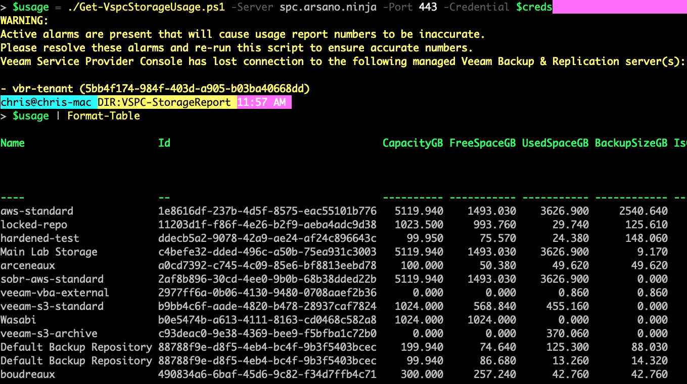

# Veeam Service Provider Console (VSPC) Storage Usage Report

Note: The script for this project was replaced with another script. The older script can still be accessed [here](https://github.com/VeeamHub/powershell/blob/c45ffa2f7b08231d8e523a22af22cac57bb89301/VSPC-StorageReport/vspcStorageReport.ps1).

## Author

* Chris Arceneaux (@chris_arceneaux)
* Jim Jones (@k00laidIT)

## Function

This script will return usage and metadata for all backup repositories for the specified VSPC server.

***NOTE:***

* `BackupSizeGB` - the sum of all backup files - is unavailable for object storage repositories. This is by design. Instead, please use `UsedSpaceGB`.
* `CapacityGB` and `FreeSpaceGB` may be unavailable for object storage repositories. This is by design as not all object storage vendors provide this information.

## Known Issues

* *None*

## Requirements

* Veeam Service Provider Console v8
  * Portal Administrator account used to access the REST API.
* Network connectivity
  * The server executing the script needs to be able to access the VSPC REST API
* PowerShell Core

## Usage

Get-Help .\Get-VspcStorageUsage.ps1

