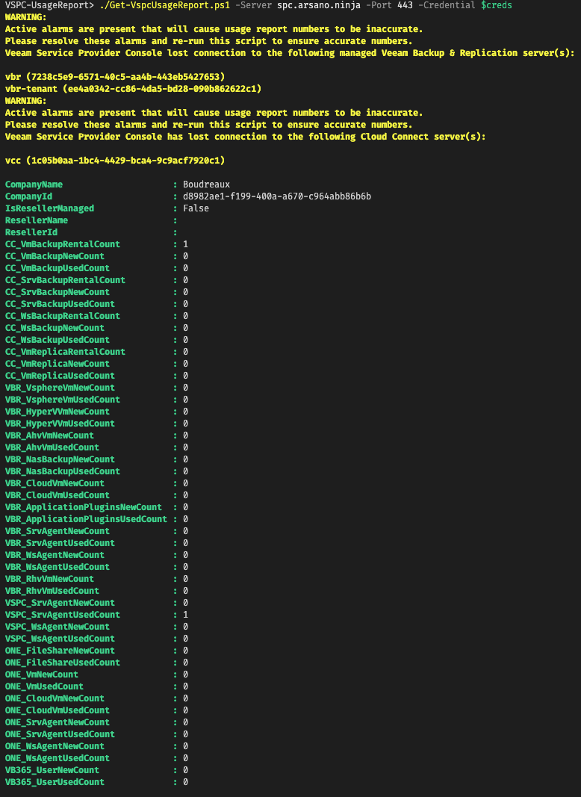

# Veeam Service Provider Console (VSPC) License Usage Report

## Author

Chris Arceneaux (@chris_arceneaux)

## Function

This script will return VSPC point in time license usage for
the current calendar month.

***NOTE:***

* This script was designed to pull usage numbers to be used for customer chargeback. For end of month rental license usage reporting to Veeam, please refer to the [Veeam Rental License and Usage Reporting Reference Guide](https://helpcenter.veeam.com/docs/vcsp/refguide/licensing_veeam_products.html).
* For usage report numbers to be accurate and holistic, **all** Veeam Backup & Replication (VBR) servers must be managed by VSPC. More information on allowing VSPC to manage VBR servers can be found in the [Veeam Service Provider Console Documentation](https://helpcenter.veeam.com/docs/vac/provider_user/connect_backup_servers.html). If multiple VSPC instances are used, then this script must be run against all of them.

## Known Issues

* *None*

## Requirements

* Veeam Service Provider Console v6
  * Portal Administrator account used to access the REST API.
* Network connectivity
  * The server executing the script needs to be able to access the VSPC REST API
* PowerShell Core

## Usage

Get-Help .\Get-VspcUsageReport.ps1

