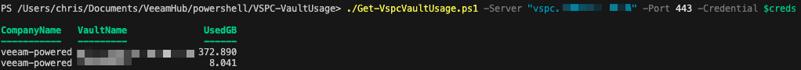

# Veeam Service Provider Console (VSPC) Vault Usage Report

## Author

Chris Arceneaux (@chris_arceneaux)

## Function

This script will return point in time usage of all Veeam Data Cloud Vault repositories connected to Veeam Backup & Replication servers managed by VSPC. Usage is separated by each Vault for each VSPC Company.

A `-Detailed` flag is also available to provide additional useful metrics.

## Known Issues

* *None*

## Requirements

* Veeam Service Provider Console v9.1
  * Portal Administrator account used to access the REST API
* Network connectivity
  * The server executing the script needs to be able to access the VSPC REST API
* PowerShell 7

#### Usage

Get-Help .\Get-VspcVaultUsage.ps1 -Full

